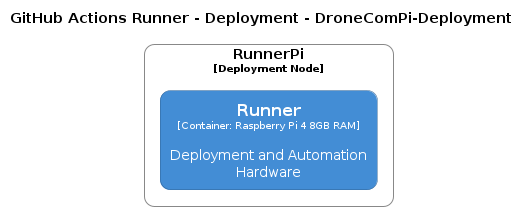
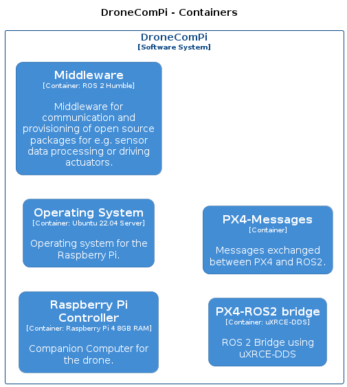
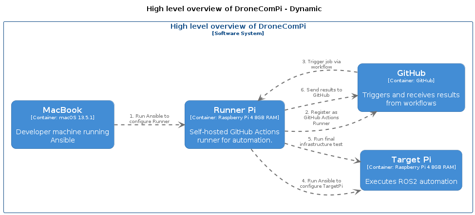
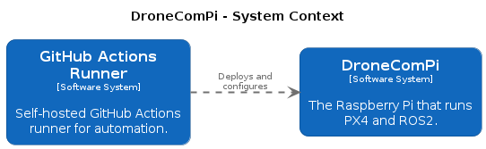

# 📝 GitHub Actions Runner Setup (compirunner)

## 💡 Objective
Set up a self-hosted GitHub Actions Runner on a Raspberry Pi (Ubuntu 22.04) to use as a local CI/CD server. The runner can then be used to automatically provision and test other Raspberry Pi devices using Ansible.

---

## 📦 Requirements
- Raspberry Pi 4/5 running Ubuntu 22.04
- SSH access to the runner device (named `compi`)
- Access to a GitHub repository
- Ansible installed on the local machine (e.g., Mac)

---

## 🔧 Setup Summary

The self-hosted runner is configured using an Ansible playbook executed from a remote machine (such as a Mac). The setup process includes:

- Setting up passwordless SSH access to the `compi`
- Installing required dependencies (e.g., curl, unzip, git)
- Downloading and configuring the GitHub Actions runner
- Registering the runner with the GitHub repository
- Starting the runner as a service so it runs in the background

The Ansible playbook handles all these steps automatically.

---

## ✅ Result
After running the setup playbook, `compi` is available as a self-hosted GitHub Actions runner. Workflows that specify the `runs-on: [self-hosted]` label will be executed on this runner.

---

# 📂 Current State: `droneComPi-setup` Repo

The repository includes:

- Ansible configuration and roles to provision the runner
- A GitHub Actions workflow for testing the runner setup

## Test Workflow
A basic test workflow exists to verify that the runner is operational. This workflow simply outputs a message and confirms the runner is responding.

### How to run the test manually:
1. Go to the GitHub repository page.
2. Click on the **"Actions"** tab.
3. Select the **"Test Local Runner"** workflow from the left menu.
4. Click **"Run workflow"**, choose the appropriate branch (e.g. `feature/initial_setup`), and confirm.
5. The workflow should be picked up and executed by `compi@runner`.

Once the test completes, you will see output confirming that the runner successfully executed the job.

# Architectural diagrams
<!-- diagrams:start -->

<!-- diagrams:end -->
